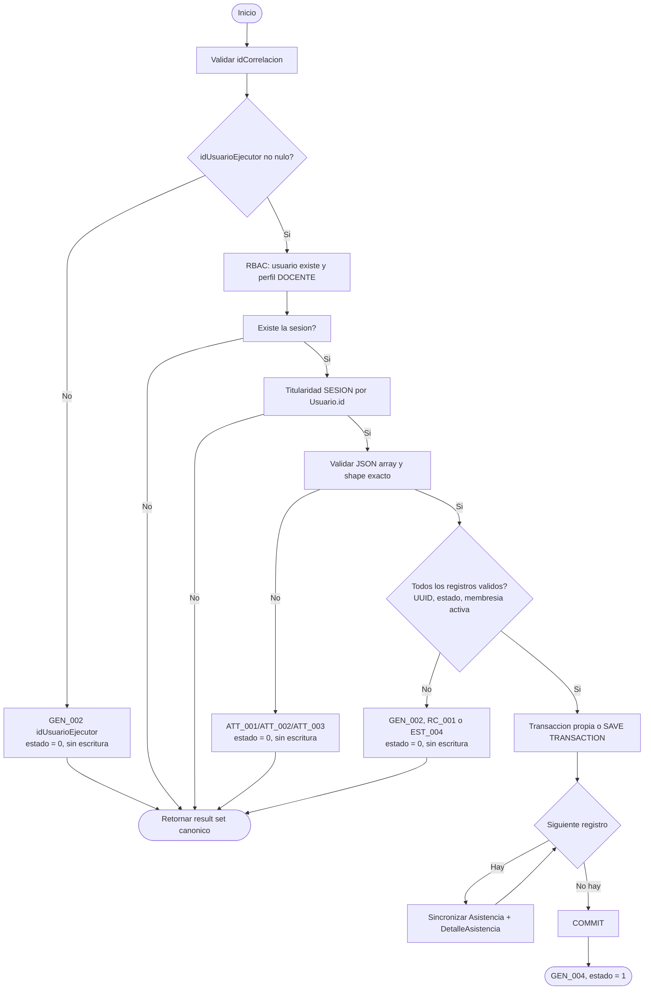

# Documentacion: `usp_registrar_asistencias_sesion`

Este documento contiene la especificacion y el flujo detallado de ejecucion del procedimiento almacenado `usp_registrar_asistencias_sesion` y sus sub-procedimientos de soporte. Es la fuente autoritativa del contrato DB del Golden Path *registrar asistencias de sesion en lote -> consultar asistencias por grupo/sesion*.

---

## Descripcion General

El procedimiento `usp_registrar_asistencias_sesion` permite a un docente **titular** registrar la asistencia de los estudiantes de un grupo para una sesion de clase especifica, en un unico lote atomico. Recibe la informacion como JSON, valida **todo el lote antes de escribir** y luego sincroniza `Asistencia` / `DetalleAsistencia` estudiante por estudiante.

### Parametros de Entrada
| Parametro | Tipo | Descripcion |
| :--- | :--- | :--- |
| `@idSesion` | `UNIQUEIDENTIFIER` | ID de la sesion de clase para la cual se registra asistencia |
| `@asistenciaJSON` | `NVARCHAR(MAX)` | JSON con la lista de estudiantes y su estado (ej. `[{"idEstudiante":"...", "estado":"AN"}, ...]`) |
| `@idCorrelacion` | `UNIQUEIDENTIFIER` | ID de trazabilidad/correlacion de la transaccion |
| `@idUsuarioEjecutor` | `UNIQUEIDENTIFIER` (`= NULL` en la firma) | **`Usuario.id`** del docente autenticado. **Requerido semanticamente.** |

> **OPTIONAL EN FIRMA != OPTIONAL EN CONTRATO.** El default `= NULL` se conserva unicamente por compatibilidad de firma con invocaciones antiguas. Un `NULL` (o parametro omitido) **ya no se salta RBAC ni titularidad**: el SP responde `estadoResultado = 0` con `GEN_002` (campo `idUsuarioEjecutor`) y no escribe nada.

### Identidad del ejecutor
`@idUsuarioEjecutor` es **`Usuario.id`**, la identidad autenticada. **No** es `Docente.id`, `Coordinador.id` ni `Decano.id`. Pasar el `Docente.id` del titular es rechazado (no es un `Usuario.id` valido).

### Estados publicos del lote (contrato canonico)
| Codigo | Significado | `DetalleAsistencia.asistio` |
| :--- | :--- | :--- |
| `AN` | asistencia normal | `1` |
| `SJC` | sin justa causa | `0` |
| `EX` | excusa | `0` |

- El estado se normaliza con `TRIM` + `UPPER` **antes** de validar (`" sjc "` -> `SJC`).
- Cualquier otro valor es **invalido**: `A`, `F`, `T`, `J`, `ABC`, vacio, solo espacios, ausente o `NULL`. **No** existe conversion automatica `A -> AN` / `F -> SJC` en el contrato publico ni en el helper interno del Golden Path.
- Un estado invalido responde `estadoResultado = 0` con el mensaje de catalogo **`RC_001`** y no escribe nada (ni siquiera los registros validos del mismo lote).

### Resultado (result set canonico — una unica fila)
| Columna | Tipo |
| :--- | :--- |
| `idCorrelacion` | `UNIQUEIDENTIFIER` |
| `mensajeUsuarioResultado` | `NVARCHAR(4000)` |
| `mensajeTecnicoResultado` | `NVARCHAR(4000)` |
| `estadoResultado` | `BIT` |

El result set no cambio respecto a versiones anteriores.

---

## Contrato de lectura (vistas)

El backend lee el estado de asistencia **exclusivamente por vista**:

```sql
SELECT da.codigoRazonCausa AS estado FROM dbo.uv_detalle_asistencia da ...
```

- `dbo.uv_detalle_asistencia` expone filas persistidas; no materializa estudiantes omitidos ni interpreta ausencia como asistencia.
- `dbo.uv_detalle_asistencia` expone `idRazonCausa`, `nombreRazonCausa` y **`codigoRazonCausa`** (= `RazonCausa.codigo`).
- `dbo.uv_razon_causa` expone `id`, `nombre` y **`codigo`**.
- Ambas adiciones son aditivas; los tests `VIEW_RAZON_CAUSA_CONTRACT` y `VIEW_DETALLE_ASISTENCIA_CONTRACT` (`test/test_public_objects.sql`) fallan si alguien retira esas columnas.

---

## RazonCausa es un catalogo cerrado

Ningun camino de este procedimiento (ni de `usp_sincronizar_asistencia_estudiante_interno`) **crea** filas en `dbo.RazonCausa`. Un codigo desconocido se rechaza con `RC_001` (`estadoResultado = 0`), sin `INSERT` ni `UPDATE` de catalogo. Los codigos historicos (`CPVP`, `CPI`, etc.) se conservan.

`RC_001` (sembrado en `schema/seed/04_mensaje.sql`, catalogos de usuario y tecnico):

| Catalogo | Contenido |
| :--- | :--- |
| Usuario | `El estado de asistencia {} no corresponde a una razón de causa válida.` |
| Tecnico | `RazonCausa.codigo = [{}] no existe o no es válido para el contrato de asistencia.` |

El backend (`DbFailureClassifier`) clasifica este mensaje como estado de asistencia invalido.

---

## Seguridad: RBAC y titularidad

1. `@idUsuarioEjecutor` no nulo (`GEN_002`).
2. Usuario existente y con perfil `DOCENTE` (`usp_validar_permiso_rbac_usuario_interno`).
3. La sesion existe (`SES_001` si no).
4. **Titularidad de la sesion** (`usp_validar_titularidad_jerarquica_interno`, tipo `SESION`): `Sesion -> Grupo -> Docente.id -> uv_docente_identidad -> idUsuario = @idUsuarioEjecutor`. Un docente distinto (aunque valido) es rechazado (`SEC_002`).

Mapeo de identidad usado por el helper de titularidad (`@idUsuario` = `Usuario.id`):

| Tipo | Cadena de resolucion |
| :--- | :--- |
| `GRUPO` | `uv_grupo.idDocente` (Docente.id) -> `uv_docente_identidad.id` -> `idUsuario` |
| `SESION` | `uv_sesion -> uv_grupo.idDocente` -> `uv_docente_identidad` -> `idUsuario` |
| `PROGRAMA` | `uv_programa.idCoordinador` (Coordinador.id) -> `uv_coordinador_identidad` -> `idUsuario` |
| `FACULTAD` | `uv_facultad.idDecano` (Decano.id) -> `uv_decano_identidad` -> `idUsuario` |
| `INSTITUCION` | `Administrador.usuario` (ya es `Usuario.id`) |

---

## Procedimientos Internos Relacionados

1. **`usp_validar_permiso_rbac_usuario_interno`**: usuario existente y perfil requerido.
2. **`usp_validar_sesion_exista_por_id_interno`**: la sesion existe.
3. **`usp_validar_titularidad_jerarquica_interno`**: titularidad por `Usuario.id` (ver mapeo).
4. **`usp_validar_estudiante_pertenece_a_grupo_de_sesion_interno`**: cada estudiante esta inscrito activamente (`EstudianteGrupo.estado.codigo = 'A'`) en el grupo de la sesion.
5. **`usp_sincronizar_asistencia_estudiante_interno`**: inserta/actualiza `Asistencia` + `DetalleAsistencia`. Resuelve una `RazonCausa` **existente** y solo acepta `AN`, `SJC`, `EX`; `A/F` ya no son aliases validos.

---

## Secuencia definitiva

1. Crear/normalizar correlacion.
2. Exigir `idUsuarioEjecutor`.
3. Validar RBAC `DOCENTE`.
4. Validar existencia de sesion (`SES_001`).
5. Validar titularidad del docente sobre la sesion (`SEC_002`).
6. Validar estructura JSON antes de `OPENJSON`: no nulo, JSON valido, top-level array, cada elemento objeto con exactamente `idEstudiante` y `estado`.
7. Rechazar lote vacio (`ATT_002`).
8. Normalizar UUID/estado (`TRIM` + `UPPER`) y rechazar UUID/estado invalidos (`GEN_002` / `RC_001`).
9. Rechazar estudiante duplicado dentro del lote (`ATT_003`).
10. Validar membresia activa para TODOS los registros antes de escribir.
11. Abrir transaccion propia o savepoint.
12. Sincronizar de forma idempotente una cabecera `Asistencia` por `(estudianteGrupo, sesion)` y un detalle por `asistencia`.
13. Retornar una unica fila canonica.

El lote puede ser parcial. Un estudiante omitido conserva semantica **SIN REGISTRO**: no se crea `Asistencia` ni `DetalleAsistencia`.

---

## Diagrama de Flujo de Ejecucion (Mermaid)



Manejo global: `BEGIN CATCH` revierte segun ownership transaccional y responde `SYS_001` con `estadoResultado = 0`.

---

## Atomicidad y transaccion

- Todo se valida (ejecutor, RBAC, sesion, titularidad, JSON completo, duplicados, estados y membresia activa) **antes** de abrir la transaccion; si falla, no se escribe nada.
- El lote escribe dentro de `BEGIN TRANSACTION ... COMMIT` propio. Si el SP es invocado con una transaccion externa abierta usa `SAVE TRANSACTION` y, ante un fallo, hace `ROLLBACK` al savepoint (patron de ownership de `docs/procedimiento-transacciones`), sin cerrar la transaccion del llamador.
- Un fallo a mitad del lote (p. ej. un estudiante que no pertenece al grupo) revierte **todos** los registros ya escritos del lote (`ATTENDANCE_BULK_ATOMIC`).
- La responsabilidad transaccional permanece en la DB; el backend no agrega `@Transactional`.

---

## Cobertura de pruebas del gate (`test/test_attendance_commands.sql`)

`ATTENDANCE_BULK_SUCCESS` (AN, `asistio=1`), `ATTENDANCE_BULK_SJC`, `ATTENDANCE_BULK_EX`, `ATTENDANCE_BULK_INVALID_JSON`, `ATTENDANCE_BULK_NOT_ARRAY`, `ATTENDANCE_BULK_EMPTY`, `ATTENDANCE_BULK_DUPLICATE_STUDENT`, `ATTENDANCE_BULK_INVALID` (sesion inexistente), `ATTENDANCE_BULK_INVALID_STATE` (ABC, A, F, T, J, vacio, ausente, espacios; sin `RazonCausa` nueva), `ATTENDANCE_BULK_EXECUTOR_REQUIRED` (NULL y omitido), `ATTENDANCE_BULK_NON_OWNER` (otro `Usuario.id` y `Docente.id` del titular), `ATTENDANCE_BULK_STUDENT_NOT_IN_GROUP`, `ATTENDANCE_BULK_ATOMIC`, `ATTENDANCE_HELPER_CLOSED_CATALOG`, `ATTENDANCE_NO_LEGACY_PUBLIC_STATE`; titularidad por `Usuario.id` en `test/test_titularidad_jerarquica.sql`.
